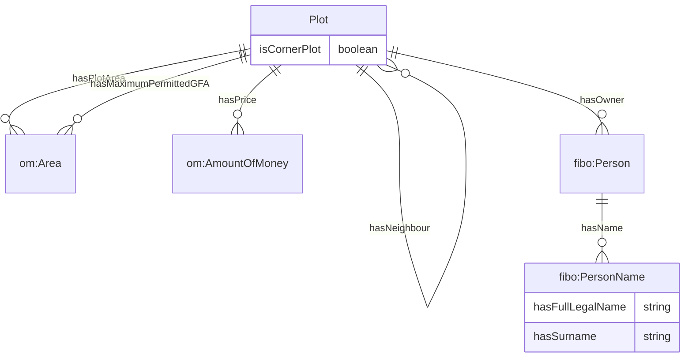

# Ontology for Plot
## 1. Introduction
OntoPlot is an ontology developed to describe the attributes of land plots. A simple overview of the key attributes of the data model are illustrated in Figure 1. 

*Figure 1. Data model of plot attributes in OntoPlot*

## 2. Legend
Prefix | Namespace
--- | ---
[opr](https://github.com/ogcincubator/cityrdf/examples/ontoplanningregulation/) | `https://graphdb.accordproject.eu/kg/ontoplanningregulation/`
[ontozoning](https://github.com/ogcincubator/cityrdf/examples/ontozoning/) | `https://graphdb.accordproject.eu/kg/ontozoning/`
[om](https://github.com/HajoRijgersberg/OM) | `http://www.ontology-of-units-of-measure.org/resource/om-2/`
[fibo](https://spec.edmcouncil.org/fibo/ontology/FND/AgentsAndPeople/People/Person) | `https://spec.edmcouncil.org/fibo/ontology/FND/AgentsAndPeople/People/`